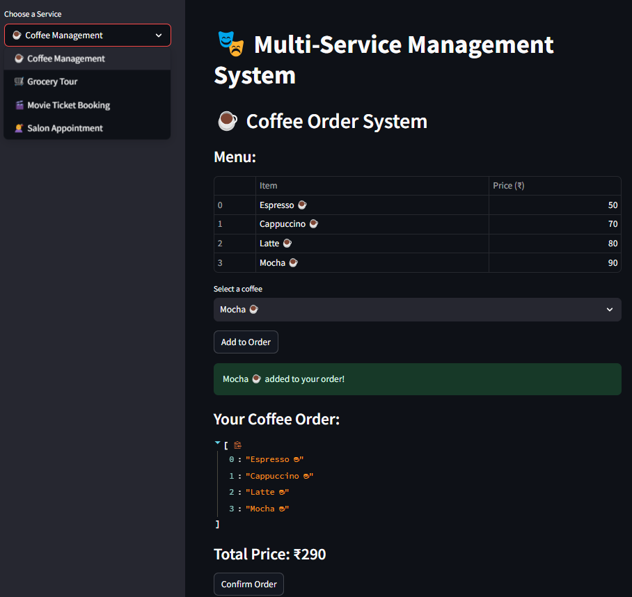
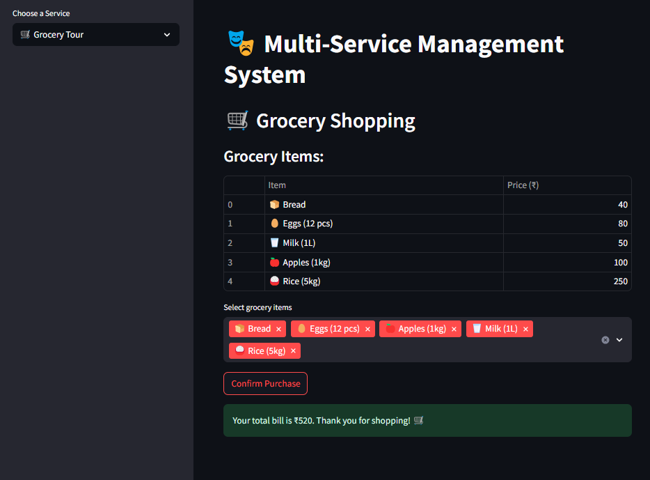
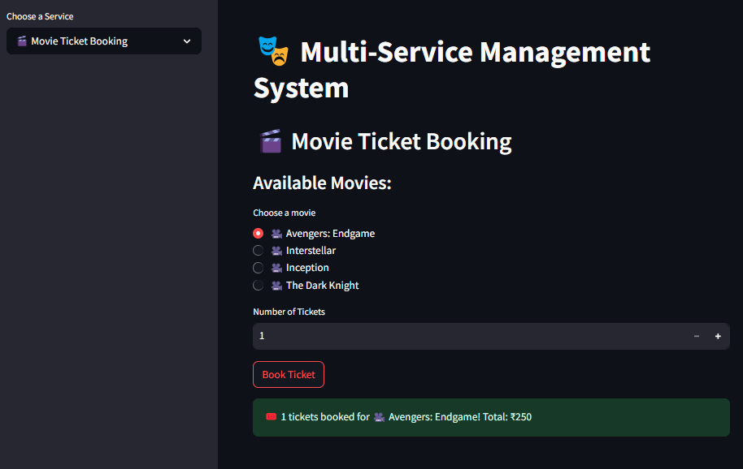
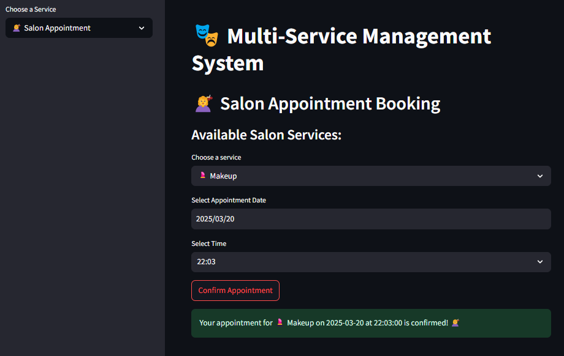

# 🔥 **Multi Service Management System**

A **Python-based application** built using 🚀 **Streamlit** that offers **multiple services** in one place:  
☕ **Coffee Ordering**  
🛒 **Grocery Shopping**  
🎥 **Movie Ticket Booking**  
💇 **Salon Appointment Scheduling**  

---

## 🛠️ **Output Screenshots**

### ☕ Coffee Ordering  
  

### 🛒 Grocery Shopping  
  

### 🎥 Movie Ticket Booking  
  

### 💇 Salon Appointment Scheduling  
  

---

## 👩‍💻 **Created By**
👤 **Ayesha Siddiqa JH**  
📧 [Email](mailto:ayeshasiddiqajh422@gmail.com) | 🔗 [LinkedIn](https://www.linkedin.com/in/ayesha-siddiqa-j-h-1866ab334/) | 🖥️ [GitHub](https://github.com/Ayesha-Siddiqa-JH)  
